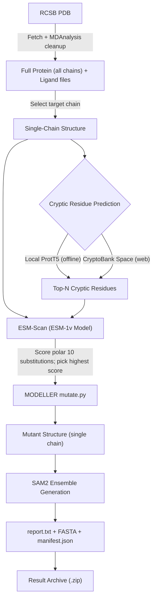

# CryptiScan

CryptiScan is an automated computational pipeline for predicting, perturbing, and validating **cryptic binding pockets** in proteins.

## Pipeline Overview

1. **Structure Preparation**: Fetches the experimental structure from RCSB, splits it with MDAnalysis into the full protein (all chains, standard residues) plus one file per ligand, and reduces it to the chain you select — every stage below operates on that single chain.
2. **Cryptic Residue Prediction**: Identifies the top residues predicted to form cryptic pockets, either locally via a ProtT5 model (offline) or through the CryptoBank web Space.
3. **ESM-Scan (Zero-Shot Scoring)**: Evaluates all 19 alternative amino acid mutations at each cryptic residue using ESM-1v log-probabilities and selects the mutation with the highest evolutionary/fitness score.
4. **MODELLER Mutagenesis**: Constructs the mutant 3D structure, applying each selected mutation in sequence with sidechain energy minimization.
5. **SAM2 Ensemble Sampling**: Generates conformational ensembles on the mutant structure to sample cryptic pocket opening.
6. **Report & Archive**: Writes a human-readable `report.txt` plus wild-type/mutant FASTA sequences, then packages every output into a single timestamped `.zip`.

For instructions on launching the pipeline, see [pipeline/README.md](pipeline/README.md).
