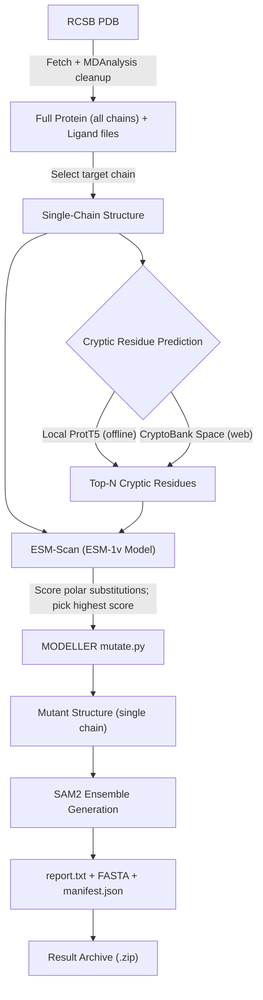

# CryptiScan

CryptiScan is an automated computational pipeline for predicting, perturbing, and validating **cryptic binding pockets** in proteins.



---

## Pipeline Workflow

```
                      PDB ID  or  local .pdb
                                  │
                                  ▼
  ┌───────────────────────────────────────────────────────────────┐
  │ 1. Fetch from RCSB + Cleanup        [MDAnalysis]              │
  │    <pdb>_raw.pdb       entry as downloaded                    │
  │    <pdb>_protein.pdb   full protein, ALL chains               │
  │    <pdb>_ligands/      one file per ligand, any resname       │
  │    waters dropped, alternate locations collapsed              │
  └───────────────────────────────┬───────────────────────────────┘
                                  ▼
  ┌───────────────────────────────────────────────────────────────┐
  │ 2. Chain Selection                  [MDAnalysis]              │
  │    <pdb>.pdb   the chain set by CHAIN in the launcher.        │
  │    Standard residues + CA verified. Every stage below         │
  │    operates on this single chain.                             │
  └───────────────────────────────┬───────────────────────────────┘
                                  ▼
  ┌───────────────────────────────────────────────────────────────┐
  │ 3. Cryptic Residue Prediction                                 │
  │    Local ProtT5 (offline)  or  CryptoBank Space (web)         │
  │    -> <PDB>_<chain>_cryptic.json                              │
  └───────────────────────────────┬───────────────────────────────┘
                                  ▼
  ┌───────────────────────────────────────────────────────────────┐
  │ 4. ESM-Scan                             [ESM-1v]              │
  │    Scores every substitution, then picks the best CHARGED     │
  │    or POLAR one. Conservative nonpolar swaps (ILE->VAL)       │
  │    would leave the pocket shut.                               │
  └───────────────────────────────┬───────────────────────────────┘
                                  ▼
  ┌───────────────────────────────────────────────────────────────┐
  │ 5. In Silico Mutagenesis              [MODELLER]              │
  │    Mutates and relaxes sidechains                             │
  │    -> <pdb>_top<N>_esm_mutant.pdb                             │
  └───────────────────────────────┬───────────────────────────────┘
                                  ▼
  ┌───────────────────────────────────────────────────────────────┐
  │ 5b. Validate for SAM2               [MDAnalysis]              │
  │     -> sam2_input.pdb                                         │
  └───────────────────────────────┬───────────────────────────────┘
                                  ▼
  ┌───────────────────────────────────────────────────────────────┐
  │ 6. Ensemble Generation             [aSAM / SAM2]              │
  │    GPU conformational sampling -> ensemble_output.*           │
  └───────────────────────────────┬───────────────────────────────┘
                                  ▼
  ┌───────────────────────────────────────────────────────────────┐
  │ 6b. Ensemble Clustering         [MDAnalysis + scipy]          │
  │     PCA + k-means on CA, one frame per cluster                │
  │     -> ensemble_clusters/                                     │
  └───────────────────────────────┬───────────────────────────────┘
                                  ▼
  ┌───────────────────────────────────────────────────────────────┐
  │ 7. Report + Sequences                                         │
  │    <jobname>_report.txt, <PDB>_<chain>_wildtype.fasta,        │
  │    <PDB>_<chain>_mutant.fasta                                 │
  └───────────────────────────────┬───────────────────────────────┘
                                  ▼
  ┌───────────────────────────────────────────────────────────────┐
  │ 8. Archive  ->  <jobname>_<timestamp>.zip                     │
  └───────────────────────────────────────────────────────────────┘
```

---

## Two Versions

| | **Local Version** | **Web Version** |
|---|---|---|
| **Launcher script** | `pipeline/launch_pipeline_local.sh` | `pipeline/launch_pipeline_web.sh` |
| **Apptainer def** | `pipeline/pipeline_local.def` | `pipeline/pipeline_web.def` |
| **Container image** | `pipeline_local.sif` (~20 GB) | `pipeline_web.sif` (~12 GB) |
| **Stage 1 engine** | Local ProtT5 (`predict_cryptic_local.py`) | CryptoBank HF Space (`scrape_cryptobank.py`) |
| **Internet needed** | Only to fetch structure from RCSB (see note) | Yes — stage 1 calls `thorbenf-cryptobank.hf.space` |
| **Baked-in weights** | ESM-1v, ProtT5-XL + head, SAM2 | ESM-1v, SAM2 |

> **Note on "offline":** The local version performs cryptic-pocket *inference* locally, with no HuggingFace Space call. Stage 2 still downloads the target structure from `files.rcsb.org`. To run with no network at all, set `PDB` in the launcher to the path of a local `.pdb` file.

Both versions are fully self-contained. **The launchers pass no `--bind` flags, by design** — every script and weight is read from inside the `.sif`.

---

## How to Run

Everything is driven by the bash launcher in `pipeline/`. Open it, edit the configuration block at the top, and run it:

```bash
cd pipeline/

# 1. Edit PDB, CHAIN, TOP, MODE and MODELLER_KEY at the top of the launcher script
# 2. Run:
bash launch_pipeline_local.sh    # local version
# or
bash launch_pipeline_web.sh      # web version
```

The configuration block looks like this:

```bash
PDB="1JWP"                     # PDB accession code, or a path to a local .pdb
CHAIN="A"                      # Target chain identifier
TOP=5                          # Number of residues to mutate; a charged/polar wild type is
                               # skipped and the next-ranked cryptic residue is used instead
MODE="combined"                # "combined" = one structure; "independent" = N mutants
STRATEGY="esm"                 # "esm" = pick substitutions with ESM-Scan
MUTATION_SET="charged_polar"   # charged_polar | charged | polar | all | "ASP,GLU,..."
N_CLUSTERS=10                  # Max clusters for the SAM2 ensemble
PCA_DIM=10                     # PCA components used for clustering
JOBNAME="${JOBNAME:-1jwp}"     # Names the output folder and zip
MODELLER_KEY="${MODELLER_KEY:-MODELIRANJE}"
```

`JOBNAME` and `MODELLER_KEY` can also be set from the environment without editing the file:

```bash
JOBNAME=1lzt MODELLER_KEY=your_key_here bash launch_pipeline_local.sh
```

---

## Output Archive

Everything is packaged into a single timestamped archive:

```
<jobname>_<timestamp>.zip
├── 1jwp_raw.pdb                     entry as downloaded from RCSB
├── 1jwp_protein.pdb                 full protein, ALL chains
├── 1jwp_ligands/PO4_A1.pdb          one file per ligand, whatever its resname
├── 1jwp_prep.json                   what was kept, split out, and dropped
├── 1jwp.pdb                         SELECTED CHAIN - used by every stage below
├── 1JWP_A_cryptic.json              cryptic residue predictions
├── 1jwp_esm_summary.csv             ESM score for every charged/polar option
├── 1jwp_top5_esm_mutant.pdb         MODELLER mutant
├── sam2_input.pdb                   mutant, validated for SAM2
├── ensemble_output.*                SAM2 / aSAM conformational ensemble
├── ensemble_clusters/
│   ├── clustering/cluster_representatives.dcd   one frame per cluster
│   └── cluster_meta.sh              frame and cluster counts
├── 1JWP_manifest.json               run manifest
├── 1jwp_local_report.txt            human-readable summary of the whole run
├── 1JWP_A_wildtype.fasta            wild-type sequence of the selected chain
└── 1JWP_A_mutant.fasta              mutant sequence
```

---

## Prerequisites

- **Linux** (x86_64)
- **NVIDIA GPU** with driver ≥ 525
- **Apptainer** (or Singularity)
- A free **MODELLER license key** (academic registration at [salilab.org](https://salilab.org/modeller/registration.html))

CUDA 12.5, PyTorch 2.4, ESM-1v, ProtT5, MODELLER 10.8, and SAM2 all live inside the container.

---

## Downloading Weights & Building Containers

The weight files are ~15 GB in total and are downloaded once after cloning:

```bash
cd pipeline/
bash download_weights.sh
```

Use `--skip-prot-t5` if you only need the web image.

Build container images:

```bash
cd pipeline/
sudo apptainer build pipeline_web.sif   pipeline_web.def     # ~12 GB, web version
sudo apptainer build pipeline_local.sif pipeline_local.def   # ~20 GB, local version
chmod 0644 pipeline_local.sif pipeline_web.sif
```

---

## How ESM-Scan Scoring Works

Rather than mutating cryptic residues to a generic amino acid (like `GLU` or `ALA`), **ESM-Scan** leverages Facebook Research's pre-trained **ESM-1v** protein language model:

1. The target chain sequence is passed through ESM-1v.
2. For each position, the model computes log-probabilities for all 20 standard amino acids.
3. For any mutation $\text{WT} \to \text{Mutant}$:
   $$\text{Score} = \log P(\text{Mutant}) - \log P(\text{WT})$$
4. All 19 alternative amino acids are evaluated at each cryptic site. The amino acid with the **highest (best) score** within the specified mutation set (default: charged & polar) is chosen.
5. All scores are saved to `<PDB>_esm_summary.csv` for full transparency.
