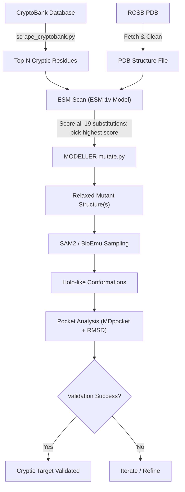

# CryptiScan

CryptiScan is an automated computational pipeline for predicting, perturbing, and validating **cryptic binding pockets** in proteins.

## Pipeline Overview

1. **CryptoBank Scoring**: Identifies the top residues predicted to form cryptic pockets.
2. **PDB Preparation**: Fetches the experimental structure and cleans chain records.
3. **ESM-Scan (Zero-Shot Scoring)**: Evaluates all 19 alternative amino acid mutations at each cryptic residue using ESM-1v log-probabilities and selects the mutation with the highest evolutionary/fitness score.
4. **MODELLER Mutagenesis**: Constructs mutant 3D structures with sidechain energy minimization and molecular dynamics simulated annealing.
5. **SAM2 Ensemble Sampling**: Generates conformational ensembles on the mutant structures to sample cryptic pocket opening.

For instructions on launching the pipeline, see [pipeline/README.md](file:///home/nsingh/Desktop/github/CryptiScan/pipeline/README.md).
