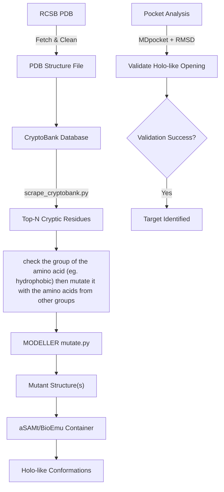

We will populate this file for the cryptic pocket algo.

Use the mutation code like this: 
python3 modeller_mutate.py 1dhk 1 HIS A > mutation.log 
% here 1dhk is the pdb filename 1dhk.pdb, 1 is the residue nymber to be mutated, HIS is the new reidue at residue number 1 and A is chain name

